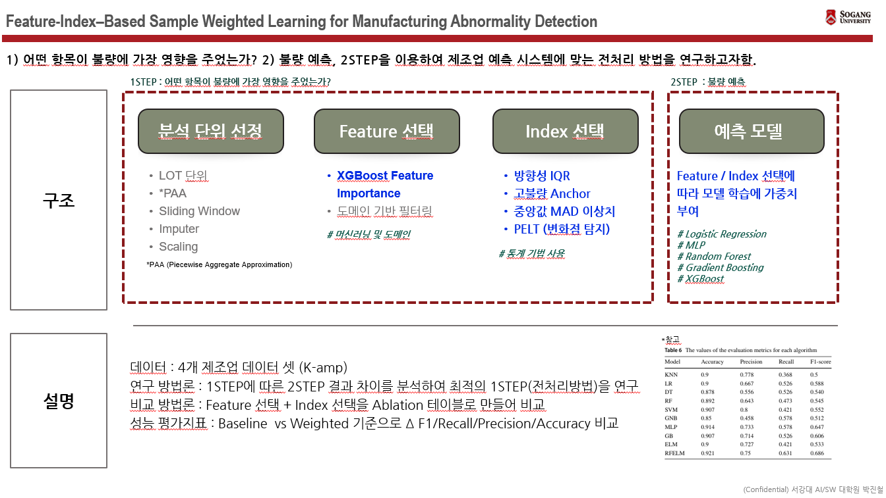

## 논문 개요


## 프로세스

1. 데이터 로드
2. Feature importance 및 통계 분석
3. EDA 산출물 생성
4. 가중치 적용 전후 모델 성능 비교
5. MLflow에 실험 기록

실행 진입점은 `src/main.py`이며, 실행 대상 데이터셋·단계·모델링 옵션은 코드 내부 `USER_INPUTS`와 환경변수로 제어합니다.

## 디렉터리 설명

- `src/main.py`: 전체 파이프라인 실행 진입점
- `src/utils/func_common.py`: 공통 설정 로드, 데이터 로딩, 파이프라인 보조 함수
- `src/utils/func_eda.py`: EDA 시각화 및 산출물 생성
- `src/utils/func_feat_imp.py`: feature importance 계산 관련 로직
- `src/utils/func_static.py`: 통계 분석 및 이상 탐지 관련 로직
- `src/utils/func_weight.py`: 가중치 데이터 생성 로직
- `src/utils/func_model.py`: 모델 선택 및 하이퍼파라미터 구성
- `src/utils/func_mlflow.py`: MLflow 설정, run 기록, artifact 저장
- `data/`: 원본 실험 데이터셋
- `result/eda/`: EDA 결과물 저장 경로
- `result/mlflow/`: MLflow DB 및 artifact 저장 경로
- `tests/`: 데이터 로딩 및 모델 전처리 단위 테스트

## 요구 사항

- Python 3.11 권장
- Docker 선택 사항
- MLflow 사용 시 로컬 Python 환경에 `requirements.txt` 설치 필요

의존성 설치:

```bash
python3 -m pip install -r requirements.txt
```

## 로컬 실행

기본 실행 명령:

```bash
python3 -m src.main
```

실행 동작은 `src/main.py`의 `USER_INPUTS`에서 제어합니다.

- `data.data_name`, `data.data_names`: 실행할 데이터셋 선택
- `steps.run_data_loader`: 데이터 로드 실행 여부
- `steps.run_analysis`: feature importance 및 통계 분석 실행 여부
- `steps.run_eda`: EDA 실행 여부
- `steps.run_modeling`: 모델링 및 MLflow 기록 실행 여부
- `static.version`: 정적 분석 버전 선택 (`v1`, `v2`)
- `weighting.baseline_index_mul`, `weighting.baseline_date_mul`: baseline 대비 가중치 배수

현재 기본 설정상 `run_modeling`은 `False`이므로, 로컬 실행만 하면 주로 데이터 로드, 분석, EDA 중심으로 동작합니다.

모델링 시 MLP와 Logistic Regression에만 `StandardScaler`를 적용합니다. 트리 계열 모델은 원본 스케일을 사용하며, feature importance 가중치는 필요한 표준화가 끝난 뒤 적용합니다. 모델 평가는 train 데이터 내부 5-fold 교차검증과 별도 test split으로 수행하고, 최종 모델은 전체 train split으로 학습합니다.

단위 테스트 실행:

```bash
python3 -m unittest discover -s tests -v
```

## Docker 실행

이미지 빌드:

```bash
docker build -t thesis-model .

```

## MLflow + Docker 실행

모델링 결과를 MLflow에 기록하려면 먼저 tracking server를 띄워야 합니다.

### 1. MLflow 저장 폴더 생성

```bash
mkdir -p result/mlflow/artifacts
```

### 2. MLflow 서버 실행

```bash
PROTOCOL_BUFFERS_PYTHON_IMPLEMENTATION=python \
python3 -m mlflow server \
  --backend-store-uri "sqlite:///$PWD/result/mlflow/mlflow.db" \
  --artifacts-destination "file://$PWD/result/mlflow/artifacts" \
  --serve-artifacts \
  --host 0.0.0.0 \
  --allowed-hosts "127.0.0.1:5001,localhost:5001,host.docker.internal:5001" \
  --port 5001
```

브라우저 접속 주소:

- [http://127.0.0.1:5001](http://127.0.0.1:5001)

포트 점유 프로세스 확인 및 종료:

```bash
lsof -iTCP:5001 -sTCP:LISTEN -n -P
kill <PID>
```

### 3. Docker 컨테이너에서 학습 실행

환경변수로 데이터셋, 모델, 실행 단계를 제어할 수 있습니다.

주요 환경변수:

- `EXPERIMENT_PREFIX`: MLflow experiment 이름 prefix
- `EXPERIMENT_NAME`: MLflow experiment 이름 전체 직접 지정
- `DATA_NAMES`: `all` 또는 데이터셋 이름 목록
- `MODEL_NAMES`: `all` 또는 모델 이름 목록
- `RUN_DATA_LOADER`: 데이터 로드 단계 실행 여부
- `RUN_EDA`: EDA 단계 실행 여부
- `RUN_ANALYSIS`: 통계 분석 단계 실행 여부
- `RUN_MODELING`: 모델링 단계 실행 여부
- `STATIC_VERSION`: 정적 분석 버전 선택값. `v1` 또는 `v2`
- `FEATURE_IMPORTANCE_F1_THRESHOLD`: feature importance 최소 F1 기준
- `FEATURE_IMPORTANCE_RUNS`: feature importance 반복 횟수
- `FEATURE_IMPORTANCE_TOP_K`: 상위 feature 선택 개수
- `IQR_DIRECTIONAL_CORR_THRESHOLD`: `STATIC_VERSION=v1`일 때 idx 이상치 제거 상관계수 임계값
- `ANCHOR_CONTEXT_DAYS`: `STATIC_VERSION=v1`일 때 anchor 날짜 전후 비교 일수
- `ANCHOR_MIN_WINDOW_POINTS`: `STATIC_VERSION=v1`일 때 anchor 주변 최소 날짜 수
- `ANCHOR_MIN_RATE_QUANTILE`: `STATIC_VERSION=v1`일 때 high defect anchor 분위수 기준
- `ANCHOR_MIN_LEVEL_SCORE`: `STATIC_VERSION=v1`일 때 anchor 날짜 level score 기준
- `ANCHOR_MIN_SIGN_AGREEMENT`: `STATIC_VERSION=v1`일 때 defect rate와 feature 증감 부호 일치 최소 비율
- `P_CHART_SIGMA_LEVEL`: `STATIC_VERSION=v2`일 때 p-chart sigma level
- `P_CHART_MIN_SUBGROUP_SIZE`: `STATIC_VERSION=v2`일 때 p-chart 최소 subgroup 크기
- `PELT_PENALTY_SCALE`: `STATIC_VERSION=v2`일 때 PELT penalty scale
- `PELT_MIN_SEGMENT_SIZE`: `STATIC_VERSION=v2`일 때 PELT 최소 segment 크기
- `PELT_CHANGE_POINT_TOLERANCE_DAYS`: `STATIC_VERSION=v2`일 때 change point 허용 일수
- `PELT_MIN_EFFECT_SIZE`: `STATIC_VERSION=v2`일 때 최소 effect size
- `MLP_HIDDEN_LAYER_SIZES`: MLP 은닉층 크기
- `MLP_ACTIVATION`: MLP 활성화 함수
- `MLP_SOLVER`: MLP optimizer
- `MLP_MAX_ITER`: MLP 최대 반복 수
- `MLP_RANDOM_STATE`: MLP random seed
- `BASELINE_INDEX_MUL`: weighted 실행용 index 가중치 배수
- `BASELINE_DATE_MUL`: weighted 실행용 date 가중치 배수

예시:

```bash
docker run --rm \
  -e EXPERIMENT_PREFIX="1.실험" \
  -e DATA_NAMES="살균기" \
  -e MODEL_NAMES="MLPClassifier" \
  -e RUN_DATA_LOADER=1 \
  -e RUN_EDA=0 \
  -e RUN_ANALYSIS=1 \
  -e RUN_MODELING=1 \
  -e STATIC_VERSION="v2" \
  -e FEATURE_IMPORTANCE_F1_THRESHOLD=0.0 \
  -e FEATURE_IMPORTANCE_RUNS=30 \
  -e FEATURE_IMPORTANCE_TOP_K=10 \
  -e P_CHART_SIGMA_LEVEL=3.0 \
  -e P_CHART_MIN_SUBGROUP_SIZE=1 \
  -e PELT_PENALTY_SCALE=1.0 \
  -e PELT_MIN_SEGMENT_SIZE=3 \
  -e PELT_CHANGE_POINT_TOLERANCE_DAYS=1 \
  -e PELT_MIN_EFFECT_SIZE=0.0 \
  -e MLP_HIDDEN_LAYER_SIZES=64,32 \
  -e MLP_ACTIVATION=relu \
  -e MLP_SOLVER=adam \
  -e MLP_MAX_ITER=1000 \
  -e MLP_RANDOM_STATE=42 \
  -e BASELINE_INDEX_MUL=2 \
  -e BASELINE_DATE_MUL=2 \
  -e MLFLOW_TRACKING_URI="http://host.docker.internal:5001" \
  --name thesis-model \
  thesis-model
```

전체 데이터셋과 전체 모델 실행 예시:

```bash
docker run --rm \
  -e EXPERIMENT_PREFIX="[static_v1_260815]" \
  -e DATA_NAMES="all" \
  -e MODEL_NAMES="all" \
  -e STATIC_VERSION="v1" \
  -e FEATURE_IMPORTANCE_F1_THRESHOLD=0.6 \
  -e RUN_DATA_LOADER=1 \
  -e RUN_EDA=0 \
  -e RUN_ANALYSIS=1 \
  -e RUN_MODELING=1 \
  -e MLFLOW_TRACKING_URI="http://host.docker.internal:5001" \
  --name thesis-model \
  thesis-model
```

## 결과물

- EDA 결과물: `result/eda/<version>/<data_name>/`
- MLflow DB: `result/mlflow/mlflow.db`
- MLflow artifact: `result/mlflow/artifacts/`

실험 이름은 기본적으로 `{EXPERIMENT_PREFIX}--{DATA_NAME}` 형식으로 생성됩니다.  
부모 run 이름은 모델명, child run 이름은 `{MODEL_NAME}-baseline`, `{MODEL_NAME}-weighted` 형식으로 기록됩니다.

## 참고

- macOS, Windows Docker Desktop에서는 컨테이너에서 호스트 MLflow 서버 접속 시 `host.docker.internal`을 사용합니다.
- MLflow 3.x 환경에서는 `--serve-artifacts` 없이 실행하면 artifact가 UI에 기록되지 않을 수 있습니다.
- Linux에서는 필요 시 `--add-host=host.docker.internal:host-gateway` 옵션을 추가해 같은 방식으로 사용할 수 있습니다.
